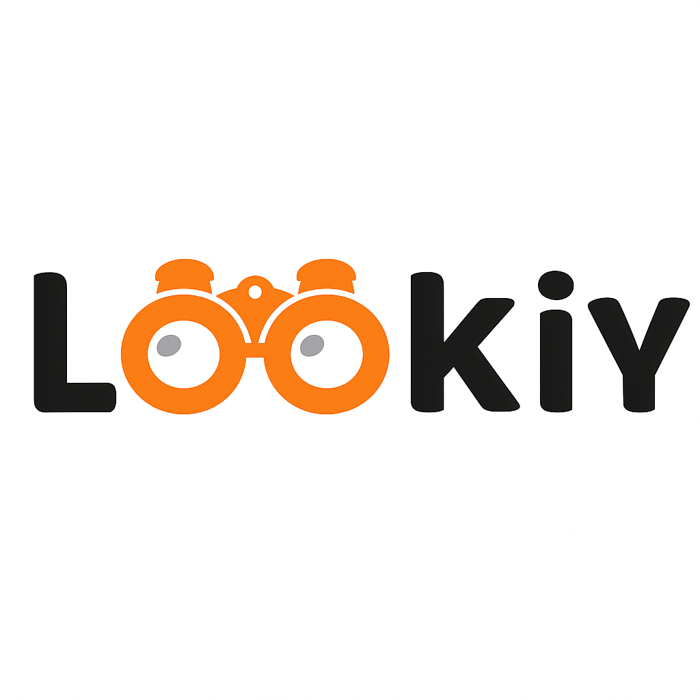

<p align="center">
      
</p>


# 👁️ Lookiy — Smart Networking & Connection Visualizer

**Lookiy** is a fast and intelligent platform that helps people discover and connect in real-world environments like events, schools, organizations, hotels, cafés, or any gathering where people should meet, learn about each other, and grow together.

Whether you're attending a conference, managing a school club, or setting up a café community — Lookiy makes networking seamless, smart, and personal.

---

## ✨ Key Features

### 👤 User Management
- Register with name, email, password, description & interests
- Email verification & secure JWT login
- Reset password via OTP email
- Public or private profile visibility
- Avatar upload or random avatar generator
- Real-time user status (online/offline)
- Instant profile updates across devices
- Live session management and device tracking

### 🌐 Network System
- Create public or private groups (networks)
- Join via @tagname, QR code, or invite link
- Passcode required for private networks
- Set network roles: Admins, Leaders, VIPs, Moderators
- Reset network passcode (admin only)
- Real-time network updates and notifications
- Live member activity tracking
- Instant join request notifications

### 🤝 Connections & Community
- Send, accept, reject connection requests
- Turn off connection request access
- View and save followers
- Access limited profiles before connection approval
- Private in-network chat
- Public open space for posts with tagging
- Real-time messaging and notifications
- Live network feed updates
- Instant connection status updates

### 🔍 Discovery & Search
- Search users by name, interest, description, and network
- Tag and follow users in shared spaces
- View user-generated posts and statuses after connection

### 🧠 AI-Powered Recommendations
- Integrated with Hugging Face's `all-MiniLM-L6-v2` model
- Match users based on interests, description, goals, and activity
- Personalized suggestions within and across networks
- Users can select or create interest tags for deeper matching

---

## 🚀 Real-Time Features
- **Live Status Updates**: See when network members are online/offline
- **Instant Notifications**: Receive immediate alerts for:
  - Network join requests
  - Connection requests
  - Profile updates
  - Role changes
  - Account status changes
- **Real-Time Messaging**: Direct messaging between network members
- **Live Activity Feed**: See network updates as they happen
- **Multi-Device Sync**: Changes reflect instantly across all devices

---

## 🎯 Use Cases

- Conferences & expos  
- School groups and alumni networks  
- NGOs & community forums  
- Business hubs, hotels, or co-working spaces  
- Social clubs or activist movements  

Where people gather — **Lookiy** brings connections to life.

---

## 🏗️ Architecture

### Core Technologies
- **Backend:** Node.js + Express
- **Database:** PostgreSQL
- **Caching:** Redis
- **Message Queue:** Apache Kafka
- **Real-time:** Socket.IO
- **Authentication:** JWT, OTP, Email Verification
- **AI Matching:** Hugging Face `all-MiniLM-L6-v2` + FAISS
- **Storage:** Google Cloud Storage
- **Deployment:** Docker, Render, Railway, or cloud provider

### Infrastructure
- Redis for session management and caching
- Kafka for event streaming and message processing
- Socket.IO with Redis adapter for horizontal scaling
- PostgreSQL for persistent data storage

---

## 🛠️ Getting Started

### Using Docker (Recommended)
```bash
# 1. Clone the repository
git clone https://github.com/kalungirasuli/lookiy.git

# 2. Navigate to the backend
cd lookiyserver

# 3. Copy environment variables
cp .env.example .env

# 4. Start the services
docker-compose up -d

# 5. Check logs
docker-compose logs -f app
```

### Manual Setup
```bash
# 1. Clone and install dependencies
git clone https://github.com/kalungirasuli/lookiy.git
cd lookiyserver
npm install

# 2. Set up infrastructure
- Install and start PostgreSQL
- Install and start Redis
- Install and configure Kafka + Zookeeper

# 3. Configure environment
cp .env.example .env
# Edit .env with your configuration

# 4. Run migrations
npm run migrate

# 5. Start the server
npm run dev
```

---

## 🌍 Deployment

### Infrastructure Requirements
- PostgreSQL database
- Redis instance for caching
- Kafka cluster for event streaming
- Storage bucket (Google Cloud Storage or similar)

### Environment Variables
See `.env.example` for required configuration variables.

### Deployment Options
1. **Docker Deployment**
   - Use provided Dockerfile and docker-compose.yml
   - Configure environment variables
   - Deploy to any container platform

2. **Platform as a Service**
   - Deploy to Render, Railway, or similar
   - Set up required add-ons:
     - PostgreSQL
     - Redis
     - Kafka
   - Configure environment variables

3. **Cloud Provider (AWS/GCP/Azure)**
   - Deploy using container services
   - Use managed services for:
     - Database (RDS/Cloud SQL)
     - Redis (ElastiCache/Memorystore)
     - Kafka (MSK/Pub/Sub)
   - Set up load balancing and auto-scaling

### Monitoring & Scaling
- Use provided logging system (Winston)
- Monitor Kafka topics and consumers
- Scale Socket.IO nodes with Redis adapter
- Configure database connection pooling

---

## 🤝 Contributing
We welcome contributions to **Lookiy**! To get involved:
1. Check our [open issues](https://github.com/kalungirasuli/lookiyserver/issues) to find ways you can help.
2. Fork the repository and create a new branch for your feature or bugfix.
3. Make your changes and commit them with clear, descriptive messages.
4. Push your branch to your forked repository.
5. Submit a pull request to the main repository, detailing your changes and the issue it addresses.

Join us in making **Lookiy** better for everyone!

---

## 📜 License
This project is licensed under the MIT License - see the [LICENSE](LICENSE) file for details.

---

## 📞 Contact
For questions or feedback, please reach out:
- Email: support@lookiy.app
- GitHub: [kalungirasuli](https://github.com/kalungirasuli)

Let's connect and grow together!

---

*Made with ❤️ by the Lookiy Team*
