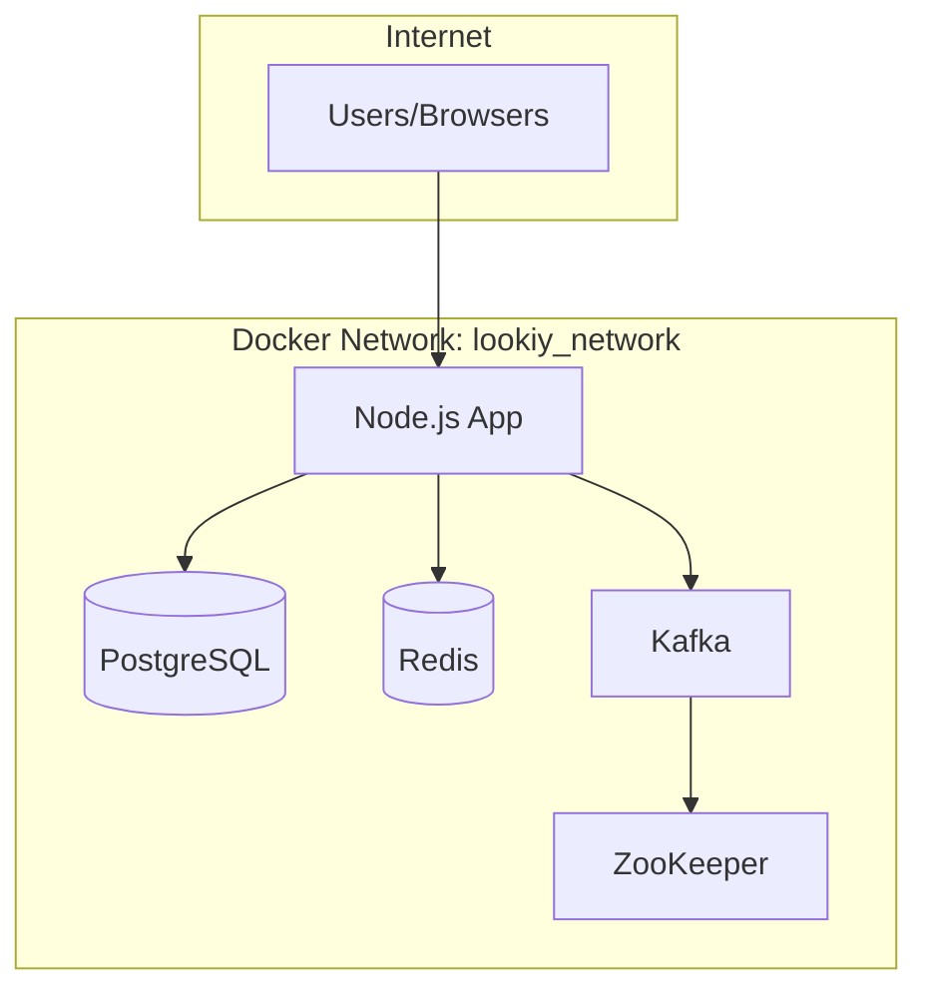
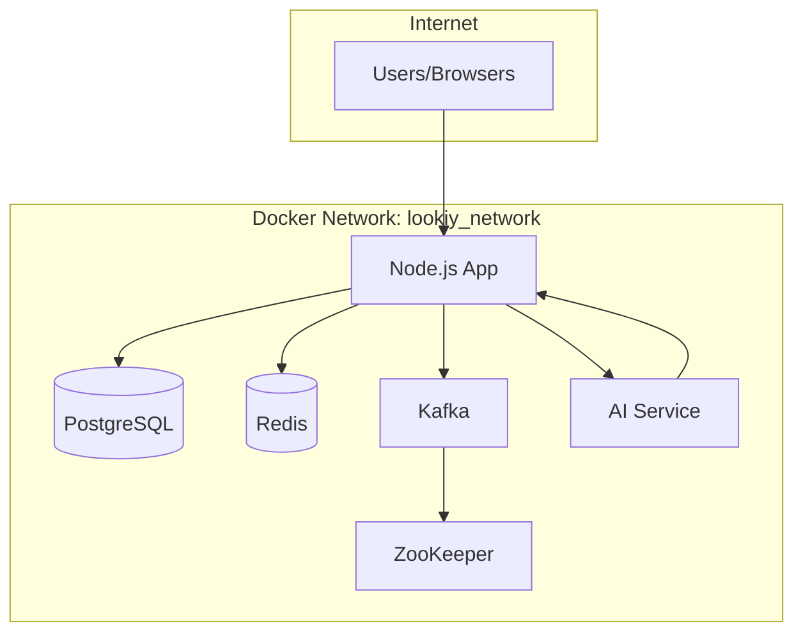

# System Architecture

## Current Architecture

## Updated Architecture with AI Service

## Service Details

### Node.js Application (app)
- **Technology**: Node.js with TypeScript
- **Port**: 3000
- **Purpose**: Main application server handling user requests, networking features, events, etc.
- **Dependencies**: PostgreSQL, Redis, Kafka

### AI Service (ai-service)
- **Technology**: Python with FastAPI
- **Port**: 8000
- **Purpose**: Job matching engine using neural networks and NLP
- **Dependencies**: None (self-contained with embedded models)

### PostgreSQL Database (postgres)
- **Technology**: PostgreSQL 14-alpine
- **Port**: 5432
- **Purpose**: Primary database for application data

### Redis Cache (redis)
- **Technology**: Redis 7-alpine
- **Port**: 6379
- **Purpose**: Caching and session storage

### Kafka Messaging (kafka)
- **Technology**: Confluent Kafka 7.3.0
- **Port**: 9092
- **Purpose**: Message queuing and event streaming

### ZooKeeper (zookeeper)
- **Technology**: Confluent ZooKeeper 7.3.0
- **Port**: 2181
- **Purpose**: Coordination service for Kafka

## Communication Flow

1. Users interact with the Node.js application through port 3000
2. The Node.js app may call the AI service for job matching through internal network calls
3. The AI service returns match scores to the Node.js app
4. The Node.js app stores/retrieves data from PostgreSQL and Redis
5. Event-driven messaging is handled through Kafka

## Deployment

All services are containerized and orchestrated using Docker Compose, ensuring:
- Isolation of services
- Easy scaling
- Consistent environments
- Simplified deployment